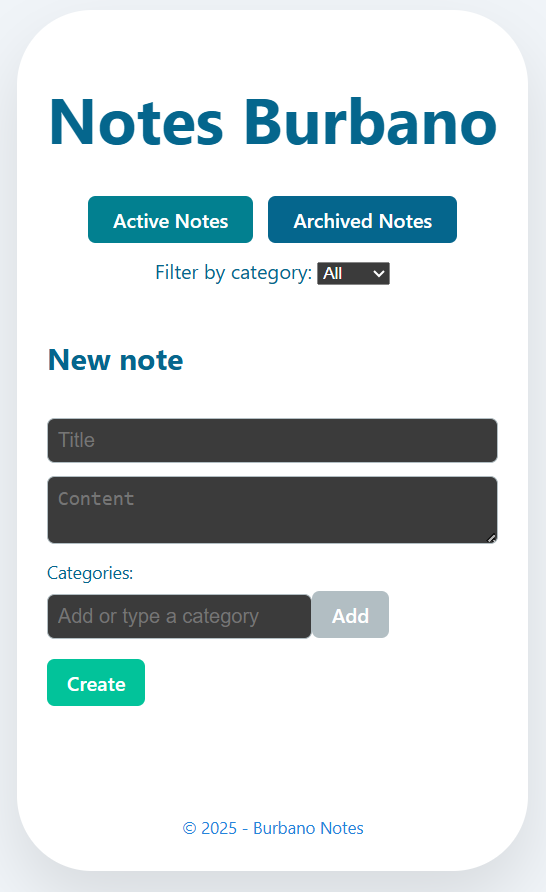

# ENSOLVERS Full Stack Challenge - Notes App

This repository contains the solution for the ENSOLVERS full stack challenge.  
It is a simple and modern Notes App, allowing you to create, edit, delete, archive/unarchive, tag, and filter your notes using a clean SPA (React) frontend and a RESTful backend (Node.js, Express, TypeORM, SQLite).

---

## Project Structure

```
/
├── backend/    # Node.js REST API with Express, TypeORM, SQLite 
├── frontend/   # SPA built with React (Vite)
├── run-all.bat # Batch script to run backend and frontend on Windows
├── README.md   # This file
```

---

## How to run (Windows)

1. Clone the repository and enter the folder.
2. Open a terminal and run:
   ```bash
   npm install --prefix backend
   npm install --prefix frontend
   ```
3. Simply execute:
   ```
   run-all.bat
   ```
   This will open two terminals:  
   - Backend: [http://localhost:4000](http://localhost:4000)
   - Frontend: [http://localhost:5173](http://localhost:5173)

> On Linux/macOS, use the instructions in each subfolder's `README.md`.

---

## Features

### Phase 1 (required)
- Create, edit, delete notes
- Archive/unarchive notes
- List active/archived notes

### Phase 2 (extra)
- Tag notes with categories
- Filter notes by category
- Edit and delete categories

---

## Tech Stack

- **Backend:** Node.js, Express, TypeORM, SQLite, JavaScript
- **Frontend:** React (Vite), Axios, JavaScript, CSS

---


## Live Demo

> No live demo (as per challenge requirements).  
> To run locally, follow the instructions above.

---
<p>
  
</p>

---

## Subfolder READMEs

- [backend/README.md](./backend/README.md) — backend instructions and requirements
- [frontend/README.md](./frontend/README.md) — frontend instructions and requirements

---